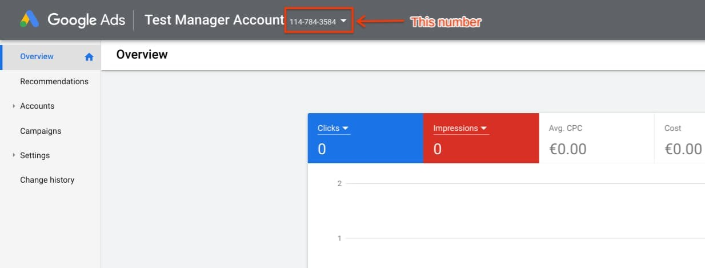
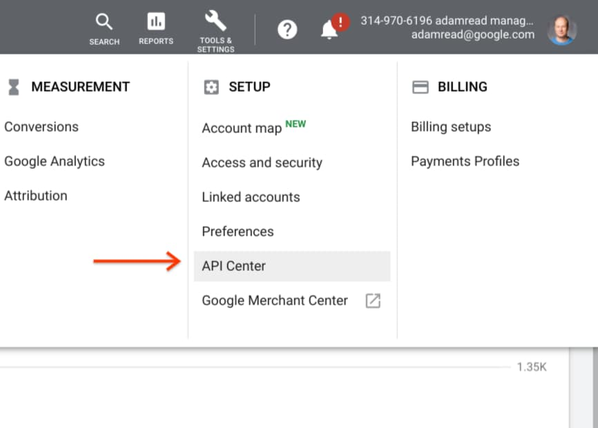
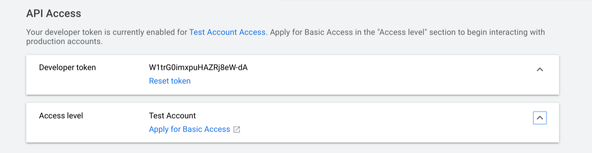
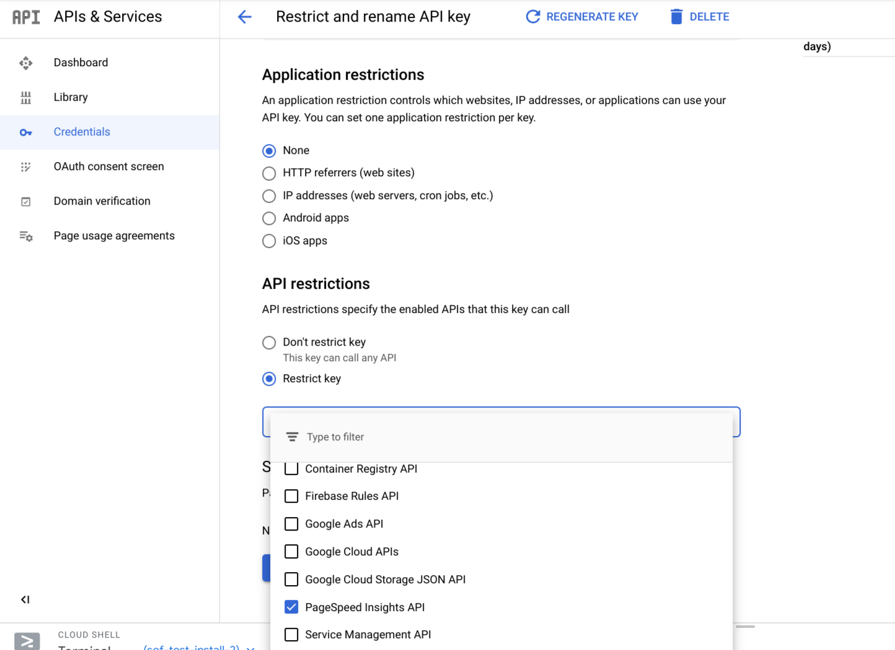

<!---
Copyright 2019 Google LLC. This solution, including any related sample code or
data, is made available on an “as is,” “as available,” and “with all faults”
basis, solely for illustrative purposes, and without warranty or representation
of any kind. This solution is experimental, unsupported and provided solely for
your convenience. Your use of it is subject to your agreements with Google, as
applicable, and may constitute a beta feature as defined under those agreements.
To the extent that you make any data available to Google in connection with your
use of the solution, you represent and warrant that you have all necessary and
appropriate rights, consents and permissions to permit Google to use and process
that data. By using any portion of this solution, you acknowledge, assume and
accept all risks, known and unknown, associated with its usage, including with
respect to your deployment of any portion of this solution in your systems, or
usage in connection with your business, if at all.
-->

# Landing Page Speed Opportunity Finder

## Gathering the required credentials

There are a number of credentials required to use the agency dashboard solution.

* **Ads Management Account ID** - This is the ID of the management account (MCC) 
that the solution will pull reports for.
* **OAuth Client ID &amp; Client Secret** - These are the credentials created 
for the Cloud project for the Ads API.
* **Ads Developer Token** - This is a production developer token for the MCC you 
are using with the solution.
* **PageSpeed Insights API key** - This is an API key for using pagespeed 
insights. This API runs the lighthouse test for you.

### Finding your MCC ID

Your management account ID can be found on the Google Ads website once you have
logged in. At the top of the page next to the name of the account is a 10-digit
number in the format DDD-DDD-DDDD. This is the MCC ID. 

### Creating the Client ID &amp; Secret

The Client ID and Secret are specific to the Google Cloud project you are
hosting the solution on and can be created in the *API &amp; Services* panel of 
the Cloud Console. The process is 
[documented on the Google developers site.](https://developers.google.com/adwords/api/docs/guides/authentication#create_a_client_id_and_client_secret")

You will need to follow the instructions for a web app. The steps should 
be:
1. Configure the consent screen by clicking the button at the top-right of the 
pane and filling out the form. 

1. Return to the Credentials page and select **Create credentials** and then 
**OAuth client ID**
1. Choose *Web application* as the application type.
1. Name the client ID
1. Add the URL to the config service end_config page to the list of authorized 
redirect URIs. The URI will have the form `https://control-service-dot-
&lt;defaultHostname&gt;.appspot.com/config_end` If you're not sure of your default 
hostname, you can use the command `gcloud app describe` to find it.
1. Create the **Client ID** and **Client Secret**.
1. Copy the ID and secret for use in the solution configuration.

### Getting a Google Ads Developer Token

You will require a production developer token to be able to use the Opportunity
Finder with real accounts.

You can find your developer token in the Google Ads frontend. Select the *API 
Center* option from the *Tools &amp; Settings* menu. 

 
The Developer token should be the first item on the page. If the access level is 
*Test Account*, please click the link to apply for basic access. The solution 
will not work without a developer token with access to production accounts. 

### Requesting a PageSpeed Insights API Key

To make bulk requests to the Google PageSpeed Insights (PSI) API, you will 
require an API key. This is free, and allows you to make a maximum of 25k 
requests per day. The key is connected to a Google Cloud project, so you will 
need to create one before getting the PSI API key.

To create an API key, follow the following steps:
1. From the cloud console side menu, open the **APIs & Services -> Credentials** 
page.
1. Click the *CREATE CREDENTIALS* button and select *API Key*
1. On the resulting dialog, click *RESTRICT KEY*
1. On the resutling page, rename the API key to something memorable.
1. Under API restrictions, choose the radio button labeled *Restrict key*
1. Using the dropdown, select the PageSpeed Insights API. 

1. Save the changes made to the API key, and copy the key for use with the tool.