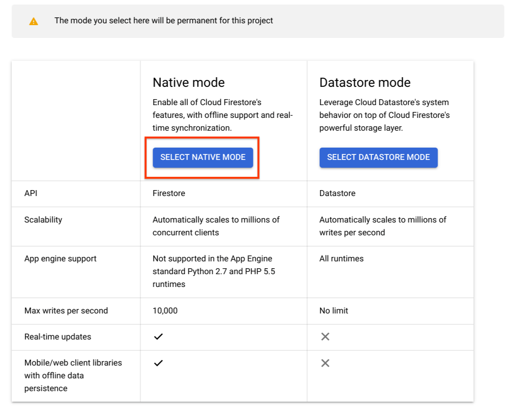
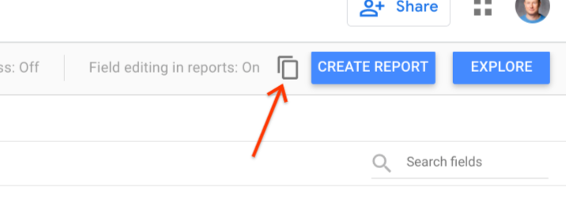
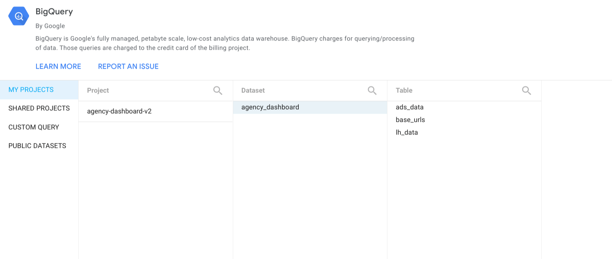
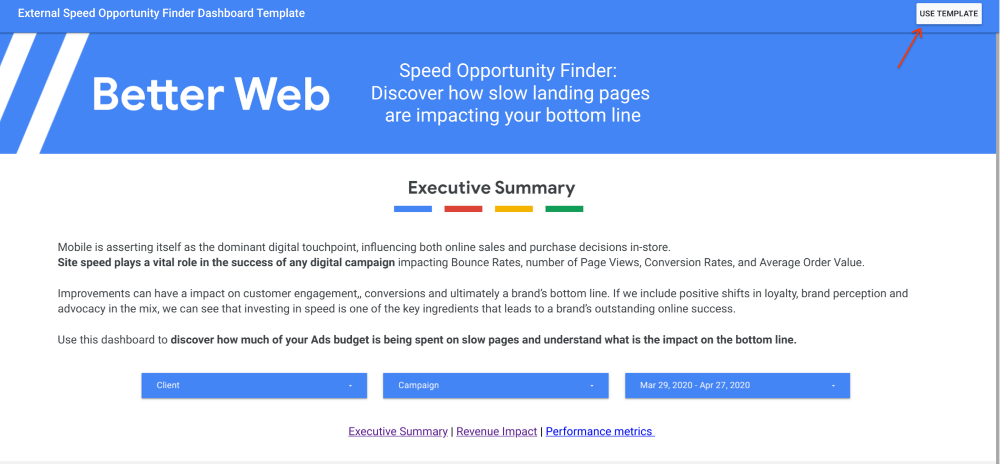
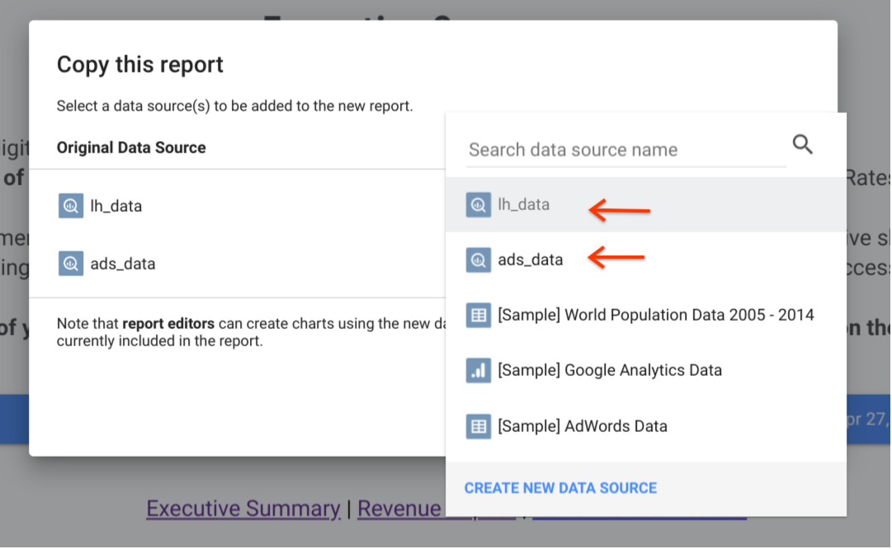

<!---
    Copyright 2019 Google LLC. This solution, including any related sample code or
    data, is made available on an “as is,” “as available,” and “with all faults”
    basis, solely for illustrative purposes, and without warranty or representation
    of any kind. This solution is experimental, unsupported and provided solely for
    your convenience. Your use of it is subject to your agreements with Google, as
    applicable, and may constitute a beta feature as defined under those agreements.
    To the extent that you make any data available to Google in connection with your
    use of the solution, you represent and warrant that you have all necessary and
    appropriate rights, consents and permissions to permit Google to use and process
    that data. By using any portion of this solution, you acknowledge, assume and
    accept all risks, known and unknown, associated with its usage, including with
    respect to your deployment of any portion of this solution in your systems, or
    usage in connection with your business, if at all.
-->

# Landing Page Speed Opportunity Finder

## Deploying the solution

1. If you haven't already, create a 
[new Google Cloud Project](https://cloud.google.com/resource-manager/docs/creating-managing-projects"). 
You can also reuse an existing project if you prefer, but you will need to 
ensure none of the existing deployed apps and big query tables conflict with 
those required by the opportunity finder.

1. In the Google cloud console, clone the 
[solution repository](https://github.com/google/speed-opportunity-finder)

1. Run the installer script with the command `$ bash install.sh`. If you don't
already have an app engine application for this cloud project, you will be asked
to create one. Follow the directions and be sure to select the correct region.

1. Enable Firestore in native mode for the project. Please be sure to select
native mode. This cannot be changed, so if you choose Datastore mode, or are 
trying to reuse a project where Datastore mode is already in use, you will need
to create a new project. 

## Finishing the deployment {#finish-deployment}

1. Collect all of the [credentials](./credentials) required to use the tool.

1. Enter the credentials you gathered on the *config* page of your deployed app. 
This should be located at `http://config-service.&lt;defaultHostname&gt;.appspot.com/config`

1. Once the credentials are entered, click the *Start OAuth Flow* button and 
complete the OAuth flow to provide the solution access to your Ads accounts. If 
successful, the page below will be shown. **Please Note**: This step must be 
carried out by someone with access to the MCC you are using for the solution.

1. To test the solution and start the first round of data collection, ping the 
controller service. This should be located at `https://controller-service.&lt;
defaultHostname&gt;.appspot.com`. Please note that the page will likely time out 
before you receive a reply. To see if it worked, check the Cloud logs and the 
BigQuery tables.
      
1. Set the Cloud project firewall rules to only allow access to the services, 
excepting the config service, from the app itself. This will ensure outside 
actors are not using project resources or adding unwanted data to the BigQuery 
tables.

## Attaching the dashboard

The final step is to attach the Data Studio dashboard to the backend. Follow
the steps below to and be sure to copy the data sources first to ensure the
calculated fields in the data sources are maintained.

1. Make a copy of both of the data studio data sources and connect them
to appropriate BigQuery tables in your cloud project. The connectors can
be found here:
* [lh_data data source](https://datastudio.google.com/datasources/62e27e18-338c-4f54-80a7-fe3d43302858)
* [ads_data data source](https://datastudio.google.com/datasources/b689944c-7d8a-4123-8fbf-4eaa5bedd2c9)
Use the copy icon, located next to the *CREATE REPORT* button, to make the copy. 

1. After confirming you want to copy the data source, a new window should open. 
Select your project, the agency_dashboard dataset, and the appropriate table for
the connector being copied. 

1. Make a copy of the 
[dashboard template](https://datastudio.google.com/u/2/reporting/3638a403-30c9-49e9-82a9-9f79ddd8999c/page/X3bCB/preview)
To copy the template, click the *USE TEMPLATE* button at the top right of the page. 

1. In the resulting dialog, choose the BigQuery data sources you created with 
your project tables. 

